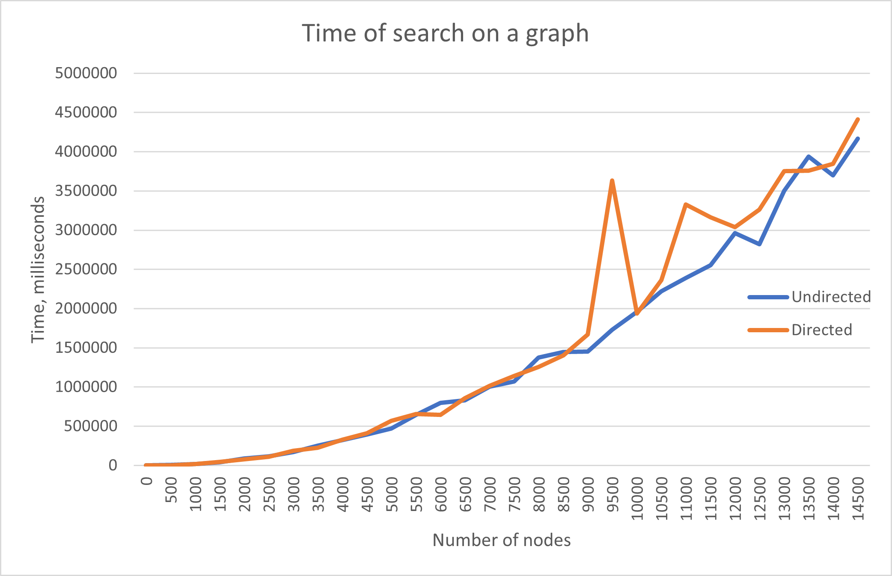

# lab3
Лабораторная работа №3 «Языки программирования и методы программирования» (информатика, 3 семестр)
Выполнил: Заволович Богдан Б20-215

1. Неориентированный граф (6 баллов) и ориентированный граф (5 баллов)
1. Поиск кратчайших путей (алгоритм Дейкстры) (5 баллов)
1. Анализ работы алгоритма на большом графе (8 баллов)
1. Генерация графа (10 баллов)
1. Материализация графа (3 балла)

37 баллов

(не миллисекунды, а микросекунды)
|

